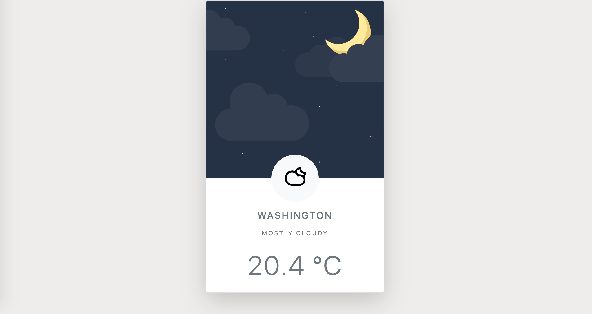

# JavaScript Weather API Project

Site created with Bootstrap5, CSS3, JavaScript, & Weather API. Deployed with Netlify.

## Table of contents

- [Screenshots](#screenshots)
- [Technologies](#technologies)
- [Live Demo](#live-demo)
- [Contact](#contact)

## Screenshots

## Technologies

- Bootstrap5, CSS3, JavaScript, & Weather API. Deployed with Netlify.

## Live Demo

View live demo here: [Demo]()

## Contact

Created by [Ibsaa J Adam](https://github.com/ibsaajadam) - feel free to contact on:
You can find me also on:

- [Linkedin](https://www.linkedin.com/in/ibsaajadam/)
- [Github](https://github.com/ibsaajadam)
